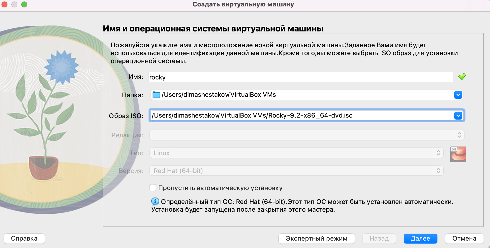
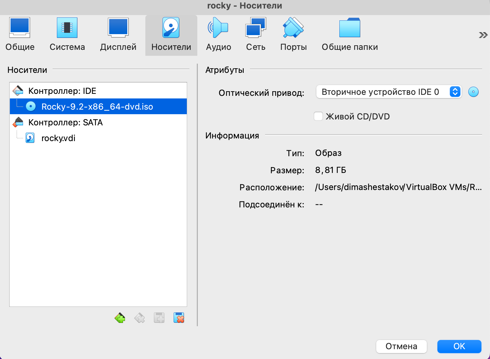
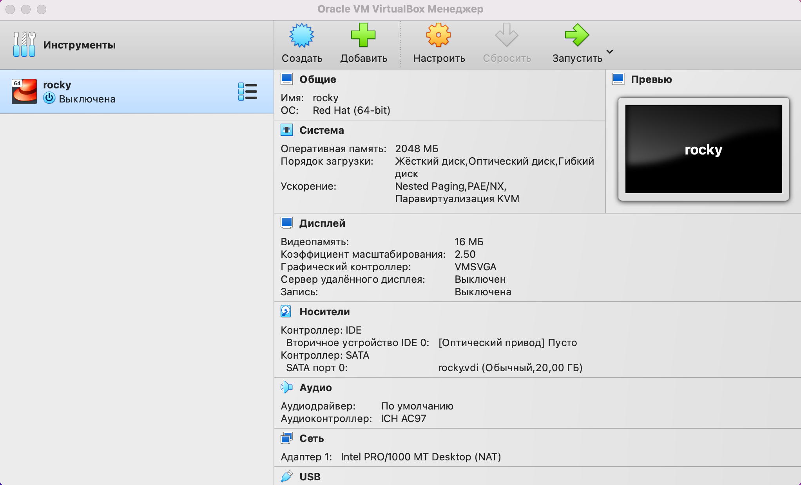
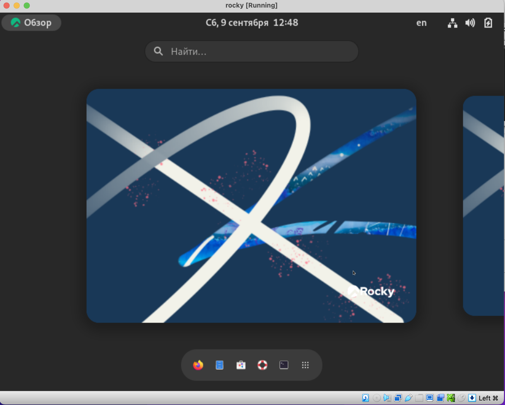

---
## Front matter
lang: ru-RU
title: Отчет по лабораторной работе №1
subtitle: Настройка рабочей среды
author:
  - Шестаков Д. С.
institute:
  - Российский университет дружбы народов, Москва, Россия
date: 9 сентября 2023

## i18n babel
babel-lang: russian
babel-otherlangs: english

## Formatting pdf
toc: false
toc-title: Содержание
slide_level: 2
aspectratio: 169
section-titles: true
theme: metropolis
header-includes:
 - \metroset{progressbar=frametitle,sectionpage=progressbar,numbering=fraction}
 - '\makeatletter'
 - '\beamer@ignorenonframefalse'
 - '\makeatother'
---

# Информация

## Докладчик

:::::::::::::: {.columns align=center}
::: {.column width="70%"}

  * Шестаков Дмитрий Сергеевич
  * студент группы НКНбд-01-20
  * Российский университет дружбы народов
  * <https://github.com/tekerinkin>

:::
::::::::::::::

# Вводная часть

## Цели и задачи

- Настроить виртуальную ОС Rocky
- Создать рабочий каталог
- Создать и настроить удаленный репозиторий

## Материалы и методы

- Bash
- Github
- Rocky OS
- VirtualBox

# Ход лабораторной работы

## Настройка ОС

 Скачали образ ОС Rocky и приступили к настройке VirtualBox

:::::::::::::: {.columns align=center}
::: {.column width="50%"}
{#fig:001 width=70%}
:::
::::::::::::::

## Настройка ОС

 Выбрали корректный носитель для ОС в VirtualBox

:::::::::::::: {.columns align=center}
::: {.column width="50%"}
{#fig:002 width=70%}
:::
::::::::::::::

## Настройка ОС

 Завершили настройку OC Rocky

:::::::::::::: {.columns align=center}
::: {.column width="50%"}
{#fig:003 width=70%}
:::
::: {.column width="50%"}
{#fig:004 width=70%}
:::
::::::::::::::

## Создание рабочего каталога

Используя командную строку, создали рабочий каталог

:::::::::::::: {.columns align=center}
::: {.column width="80%"}
```bash
cd ~
mkdir ~/work/study/2022-2023/"Информационная безопасность"/infosec
cd ~/work/study/2022-2023/"Информационная безопасность/infosec"
```
:::
::::::::::::::

## Создание удаленного репозитория

Используя командную строку и утилиту gh, создали удалленый репозиторий

:::::::::::::: {.columns align=center}
::: {.column width="70%"}
```bash
gh repo create study_2022-2023_infosec 
  --template=yamadharma/course-directory-student-template 
  --public
git clone --recursive 
  git@github.com:tekerinkin/study_2022-2023_infosec.git .
```
:::
::::::::::::::

## Настройка удаленного репозитория

Исползуя командную строку, настроили репозиторий для работы

:::::::::::::: {.columns align=center}
::: {.column width="70%"}
```bash
rm package.json
echo "infosec" > COURSE
make
git add .
git commit -m "feat(main): make course structure"
git push
```
:::
::::::::::::::

# Вывод

Подготовили рабочую среду для выоплнения лабораторных работ, освежили навыки работы с командной строкой и системами контроля версий

