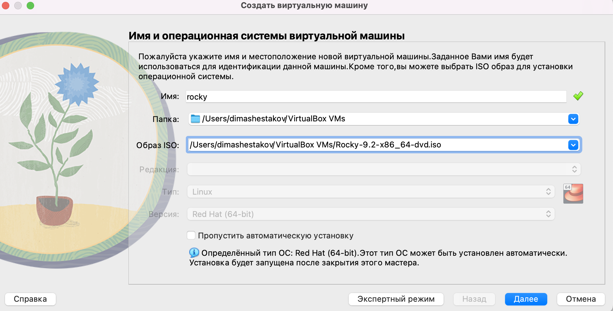
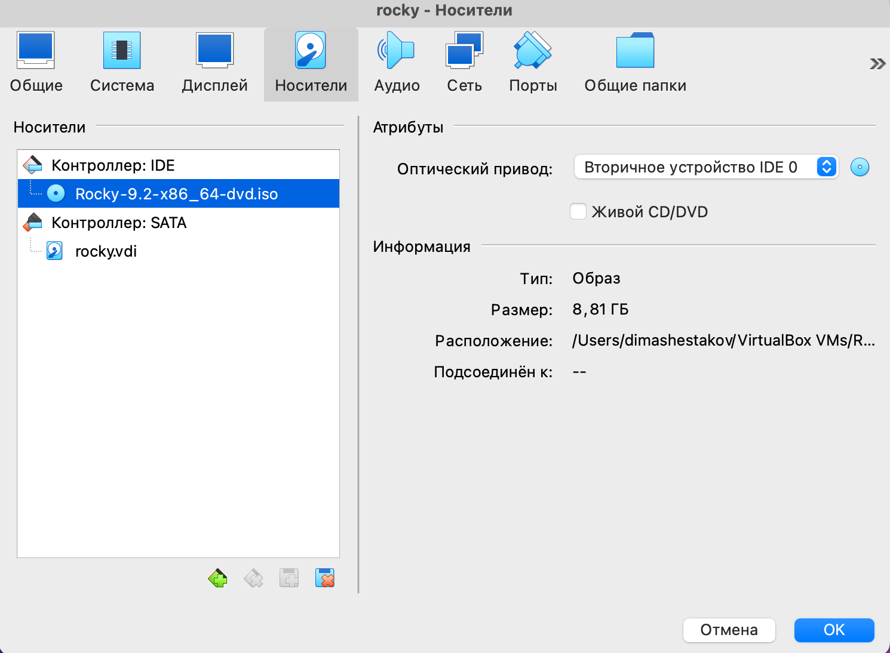
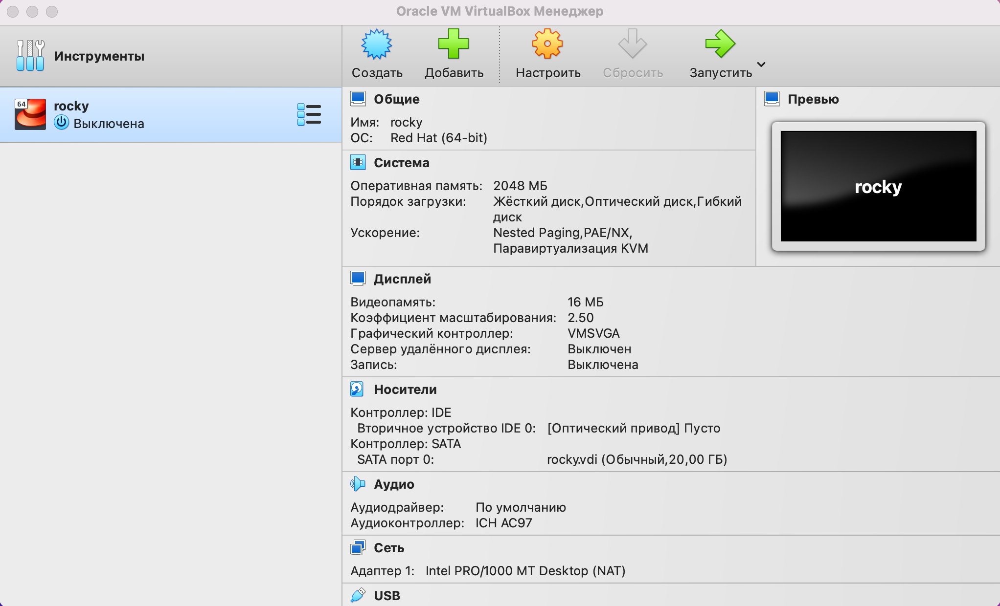
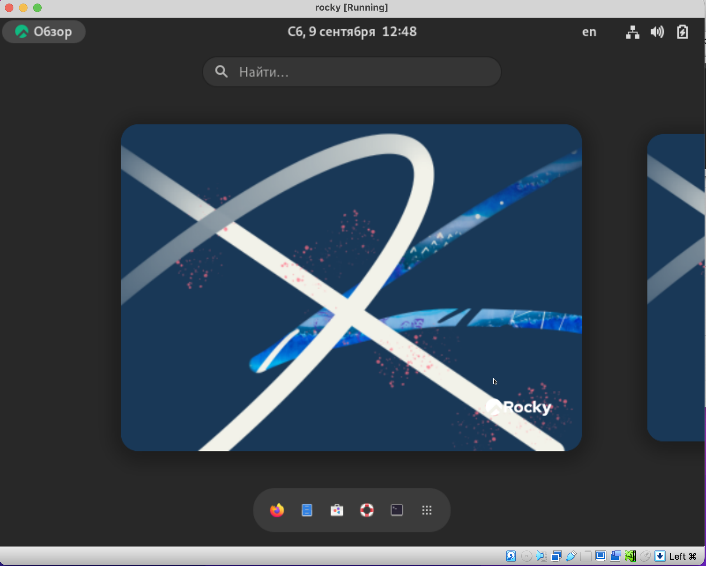

---
## Front matter
title: "Отчет по лабораторной работе №1"
subtitle: "Настройка рабочей среды"
author: "Шестаков Дмитрий"

## Generic otions
lang: ru-RU
toc-title: "Содержание"

## Bibliography
bibliography: bib/cite.bib
csl: pandoc/csl/gost-r-7-0-5-2008-numeric.csl

## Pdf output format
toc: true # Table of contents
toc-depth: 2
lof: true # List of figures
lot: true # List of tables
fontsize: 12pt
linestretch: 1.5
papersize: a4
documentclass: scrreprt
## I18n polyglossia
polyglossia-lang:
  name: russian
  options:
	- spelling=modern
	- babelshorthands=true
polyglossia-otherlangs:
  name: english
## I18n babel
babel-lang: russian
babel-otherlangs: english
## Fonts
mainfont: PT Serif
romanfont: PT Serif
sansfont: PT Sans
monofont: PT Mono
mainfontoptions: Ligatures=TeX
romanfontoptions: Ligatures=TeX
sansfontoptions: Ligatures=TeX,Scale=MatchLowercase
monofontoptions: Scale=MatchLowercase,Scale=0.9
## Biblatex
biblatex: true
biblio-style: "gost-numeric"
biblatexoptions:
  - parentracker=true
  - backend=biber
  - hyperref=auto
  - language=auto
  - autolang=other*
  - citestyle=gost-numeric
## Pandoc-crossref LaTeX customization
figureTitle: "Рис."
tableTitle: "Таблица"
listingTitle: "Листинг"
lofTitle: "Список иллюстраций"
lotTitle: "Список таблиц"
lolTitle: "Листинги"
## Misc options
indent: true
header-includes:
  - \usepackage{indentfirst}
  - \usepackage{float} # keep figures where there are in the text
  - \floatplacement{figure}{H} # keep figures where there are in the text
---

# Цель работы

Настроить рабочую среду и освежить навыки работы с командной строкой и системой контроля версий

# Задание

 - Настроить операционную систему Rocky в VirtualBox

 - Создать рабочий каталог

 - Создать удалленый репозиторий


# Выполнение лабораторной работы

1) Скачали образ операционной системы Rocky и приступили к настройке в Virtual Box (рис. @fig:001)

{#fig:001 width=70%}

2) Выбрали носитель (рис. @fig:002)

{#fig:002 width=70%}

3) Закончили настройку и получили рабочую ОС

{#fig:003 width=70%}

{#fig:004 width=70%}

4) Создали рабочий каталог

```bash
cd ~
mkdir ~/work/study/2022-2023/"Информационная безопасность"/infosec
cd ~/work/study/2022-2023/"Информационная безопасность/infosec"
```

5) Создали удаленный репозитеорий

```bash
gh repo create study_2022-2023_infosec 
  --template=yamadharma/course-directory-student-template 
  --public
git clone --recursive 
  git@github.com:tekerinkin/study_2022-2023_infosec.git .
```

6) Настроили репозиторий

```bash
rm package.json
echo "infosec" > COURSE
make
git add .
git commit -m "feat(main): make course structure"
git push
```


# Выводы

Подготовили рабочий каталог для выполнения лабораторных работ и освежили навыки работы с командной строкой и системой контроля версий.