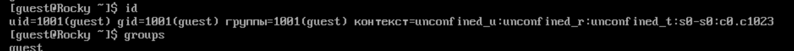
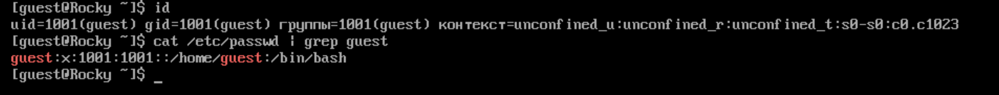

---
## Front matter
lang: ru-RU
title: Лабораторная работа №2
subtitle: Дискреционное разграничение прав в Linux. Основные атрибуты
author:
  - Шестаков Д. С.
institute:
  - Российский университет дружбы народов, Москва, Россия
date: 16 сентября 2023

## i18n babel
babel-lang: russian
babel-otherlangs: english

## Formatting pdf
toc: false
toc-title: Содержание
slide_level: 2
aspectratio: 169
section-titles: true
theme: metropolis
header-includes:
 - \metroset{progressbar=frametitle,sectionpage=progressbar,numbering=fraction}
 - '\makeatletter'
 - '\beamer@ignorenonframefalse'
 - '\makeatother'
---

# Информация

## Докладчик

:::::::::::::: {.columns align=center}
::: {.column width="70%"}

  * Шестаков Дмитрий Сергеевич
  * студент группы НКНбд-01-20
  * Российский университет дружбы народов
  * <https://github.com/tekerinkin>

:::
::::::::::::::

# Вводная часть

## Объект и предмет исследования

- ОС Linux
- Дискреционное разграничение прав
- Основные атрибуты файлов

## Цель

Получение практических навыков работы в консоли с атрибутами файлов, закрепление теоретических основ дискреционного разграничения доступа в современных системах с открытым кодом на базе ОС Linux


## Материалы и методы

- ОС Linux
- Bash

# Ход работы

## Выполнение заданий
- В уcтаноленной ОС создали учетную запись пользователя guest

- Задали пароль для пользователя guest

:::::::::::::: {.columns align=center}
::: {.column width="50%"}
{#fig:001 width=70%}
:::
::::::::::::::

## Выполнение заданий

Вошли в систему от имени пользователя guest

:::::::::::::: {.columns align=center}
::: {.column width="50%"}
{#fig:002 width=70%}
:::
::::::::::::::

## Выполнение заданий

С помощью команды ```pwd``` мы определили, что находимся в домашней директории

Уточнили имя нашего пользователя командой ```whoami```

:::::::::::::: {.columns align=center}
::: {.column width="50%"}
{#fig:003 width=70%}
:::
::::::::::::::

## Выполнение заданий

Используя команды ```id, groups``` , уточнили имя нашего пользователя. Получили следующие значения "uid = 1001", "gid = 1001"

:::::::::::::: {.columns align=center}
::: {.column width="50%"}
{#fig:004 width=70%}
:::
::::::::::::::

## Выполнение заданий

Просмотрели файл ```/etc/passwd``` командной ```cat /etc/passwd```.
Получили те же самые значения "uid", "gid"

:::::::::::::: {.columns align=center}
::: {.column width="50%"}
{#fig:005 width=70%}
:::
::::::::::::::

## Выполнение заданий

Определили существующие в системе директории командой ```ls -l /home/```. В системе существовует две директории "dima" и "guest". 

Их права доступа "drwx------"

:::::::::::::: {.columns align=center}
::: {.column width="50%"}
{#fig:006 width=70%}
:::
::::::::::::::

## Выполнение заданий

Использовали команду ```lsattr /home``` для определения атрибутов директорий. Мы смогли увидеть атрибуты директории "guest", но не смогли увидеть расширенные атрибуты директории "dima"

:::::::::::::: {.columns align=center}
::: {.column width="50%"}
{#fig:007 width=70%}
:::
::::::::::::::

## Выполнение заданий

Создали поддиректорию "dir1" командой ```mkdir dir1```.

Определили атрибуты директории "dir1": "drwxr-xr-x"

:::::::::::::: {.columns align=center}
::: {.column width="50%"}
{#fig:008 width=70%}
:::
::::::::::::::

## Выполнение заданий

Сняли все атрибуты с директории командой ```chmod 000 dir1```

:::::::::::::: {.columns align=center}
::: {.column width="50%"}
{#fig:009 width=70%}
:::
::::::::::::::

## Выполнение заданий

Попытались создать файл "file1" в директории "dir1". У нас ничего не вышло, получили сообщение, что нам отказано в доступе

Не смогли проверить наличие или отсутствие файла в директории так как не имемм прав доступа

:::::::::::::: {.columns align=center}
::: {.column width="50%"}
{#fig:010 width=70%}
:::
::::::::::::::

## Выполнение заданий

Составили таблицу возможных действий с различными правами доступа

:::::::::::::: {.columns align=center}
::: {.column width="50%"}
{#fig:011 width=70%}
:::
::::::::::::::

## Выполнение заданий

Составили таблицу минимально необходимых прав доступа

:::::::::::::: {.columns align=center}
::: {.column width="50%"}
{#fig:012 width=70%}
:::
::::::::::::::


## Вывод

Получили практические навыки работы в консоли с атрибутами файлов, закрепили теоретические основ дискреционного разграничения доступа в современных системах с открытым кодом на базе ОС Linux