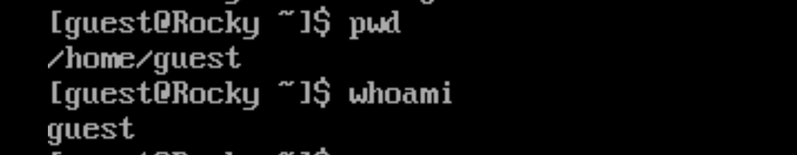
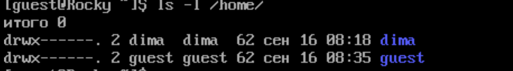
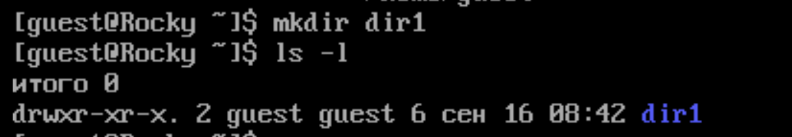
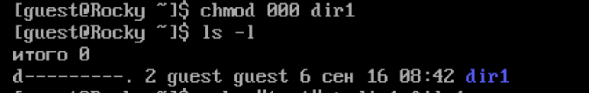
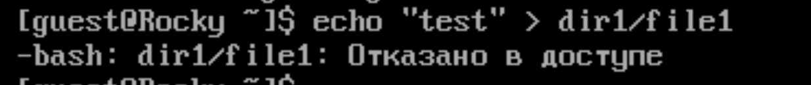
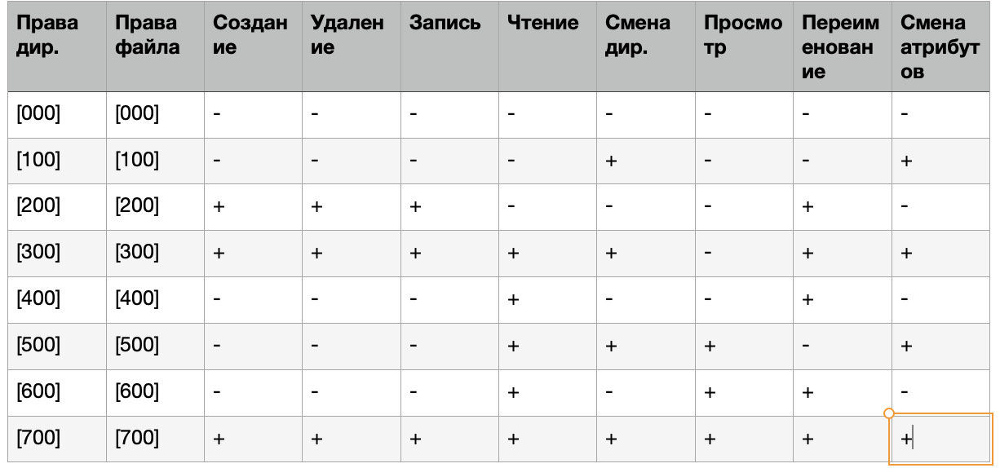

---
## Front matter
title: "Лабораторная работа №2"
subtitle: "Дискреционное разграничение прав в Linux. Основные атрибуты"
author: "Дмитрий Сергеевич Шестаков"

## Generic otions
lang: ru-RU
toc-title: "Содержание"

## Bibliography
bibliography: bib/cite.bib
csl: pandoc/csl/gost-r-7-0-5-2008-numeric.csl

## Pdf output format
toc: true # Table of contents
toc-depth: 2
lof: true # List of figures
lot: true # List of tables
fontsize: 12pt
linestretch: 1.5
papersize: a4
documentclass: scrreprt
## I18n polyglossia
polyglossia-lang:
  name: russian
  options:
	- spelling=modern
	- babelshorthands=true
polyglossia-otherlangs:
  name: english
## I18n babel
babel-lang: russian
babel-otherlangs: english
## Fonts
mainfont: PT Serif
romanfont: PT Serif
sansfont: PT Sans
monofont: PT Mono
mainfontoptions: Ligatures=TeX
romanfontoptions: Ligatures=TeX
sansfontoptions: Ligatures=TeX,Scale=MatchLowercase
monofontoptions: Scale=MatchLowercase,Scale=0.9
## Biblatex
biblatex: true
biblio-style: "gost-numeric"
biblatexoptions:
  - parentracker=true
  - backend=biber
  - hyperref=auto
  - language=auto
  - autolang=other*
  - citestyle=gost-numeric
## Pandoc-crossref LaTeX customization
figureTitle: "Рис."
tableTitle: "Таблица"
listingTitle: "Листинг"
lofTitle: "Список иллюстраций"
lotTitle: "Список таблиц"
lolTitle: "Листинги"
## Misc options
indent: true
header-includes:
  - \usepackage{indentfirst}
  - \usepackage{float} # keep figures where there are in the text
  - \floatplacement{figure}{H} # keep figures where there are in the text
---

# Цель работы

Получение практических навыков работы в консоли с атрибутами файлов, закрепление теоретических основ дискреционного разграничения доступа в современных системах с открытым кодом на базе ОС Linux


# Выполнение лабораторной работы

1. В уcтаноленной ОС создали учетную запись пользователя guest(рис. @fig:001)

```bash
useradd guest
```

2. Задали пароль для пользователя guest(рис. @fig:001)

```bash
passwd guest
```

{#fig:001 width=70%}

3. Вошли в систему от имени пользователя guest(рис. @fig:002)

```bash
su - guest
```

{#fig:002 width=70%}

4. С помощью команды ```pwd``` мы определили, что находимся в домашней директории(рис. @fig:003)

5. Уточнили имя нашего пользователя командой ```whoami```(рис. @fig:003)

{#fig:003 width=70%}

6. Используя команды ```id, groups``` , уточнили имя нашего пользователя. Получили следующие значения "uid = 1001", "gid = 1001".(рис. @fig:004)

{#fig:004 width=70%}

7. Имя пользователя и приглашение командной строки совпадают.

8. Просмотрели файл ```/etc/passwd``` командной ```cat /etc/passwd```.
Получили те же самые значения "uid", "gid", что и в пункте 6(рис. @fig:005)

{#fig:005 width=70%}

9. Определили существующие в системе директории командой ```ls -l /home/```. В системе существовует две директории "dima" и "guest". Их права доступа "drwx------".(рис. @fig:006)

{#fig:006 width=70%}

10. Использовали команду ```lsattr /home``` для определения атрибутов директорий. Мы смогли увидеть атрибуты директории "guest", но не смогли увидеть расширенные атрибуты директории "dima"(рис. @fig:007)

{#fig:007 width=70%}

11. Создали поддиректорию "dir1" командой ```mkdir dir1```.
Определили атрибуты директории "dir1": "drwxr-xr-x"(рис. @fig:008)

{#fig:008 width=70%}

12. Сняли все атрибуты с директории командой ```chmod 000 dir1```(рис. @fig:009)

{#fig:009 width=70%}

13. Попытались создать файл "file1" в директории "dir1". У нас ничего не вышло, получили сообщение, что нам отказано в доступе(рис. @fig:010)

Не смогли проверить наличие или отсутствие файла в директории так как не имемм прав доступа(рис. @fig:011)

{#fig:010 width=70%}

{#fig:011 width=70%}

14. Составили таблицу возможных действий с различными правами доступа

{#fig:012 width=70%}

15. Составили таблицу минимально необходимых прав доступа

{#fig:013 width=70%}


# Выводы

Получили практические навыки работы в консоли с атрибутами файлов, закрепили теоретические основ дискреционного разграничения доступа в современных системах с открытым кодом на базе ОС Linux


