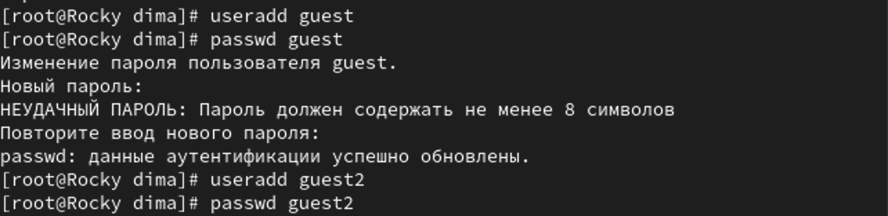
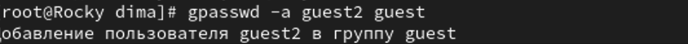
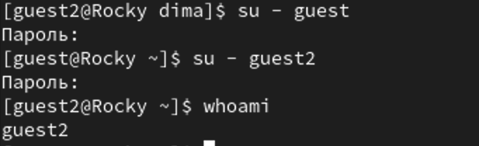
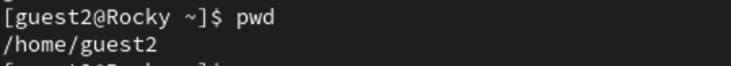
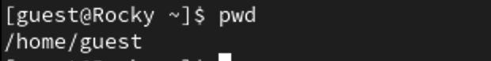
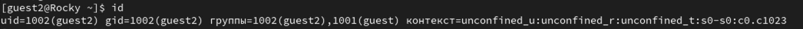
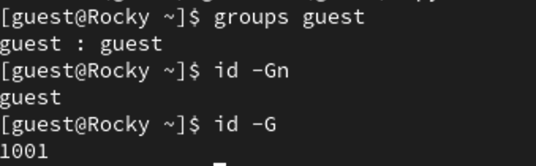
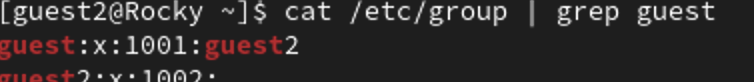

---
## Front matter
lang: ru-RU
title: Лабораторная работа №3
subtitle: Дискреционное разграничение прав в Linux. Два пользователя
author:
  - Шестаков Д. С.
institute:
  - Российский университет дружбы народов, Москва, Россия
date: 23 сентября 2023

## i18n babel
babel-lang: russian
babel-otherlangs: english

## Formatting pdf
toc: false
toc-title: Содержание
slide_level: 2
aspectratio: 169
section-titles: true
theme: metropolis
header-includes:
 - \metroset{progressbar=frametitle,sectionpage=progressbar,numbering=fraction}
 - '\makeatletter'
 - '\beamer@ignorenonframefalse'
 - '\makeatother'
---

# Информация

## Докладчик

:::::::::::::: {.columns align=center}
::: {.column width="70%"}

  * Шестаков Дмитрий Сергеевич
  * студент группы НКНбд-01-20
  * Российский университет дружбы народов
  * [dmshestakov@icloud.com](mailto:dmshestakov@icloud.com)

:::
::::::::::::::

# Вводная часть

## Объект и предмет исследования

- Rocky Linux
- Bash
- Дискреционное разграничение прав

## Цели и задачи

- Получение практических навыков работы в консоли с атрибутами файлов для групп пользователей.

# Ход работы

## Выполнение работы

В установленной операционной системе создали две учетные записи: guest и guset2

```bash
useradd guest
passwd guest

useradd guest2
passwd guest2
```

## Выполнение работы

:::::::::::::: {.columns align=center}
::: {.column width="70%"}
{#fig:001 width=70%}
:::
::::::::::::::

## Выполнение работы

Добавили пользователя guest2 в guest

```bash
gpaswwd -a guest2 guest
```

## Выполнение работы

:::::::::::::: {.columns align=center}
::: {.column width="70%"}
{#fig:002 width=70%}
:::
::::::::::::::

## Выполнение работы

Осуществили вход в систему от двух разных пользователей:

```bash
su - guest
su - guest2
```

## Выполнение работы

:::::::::::::: {.columns align=center}
::: {.column width="70%"}
{#fig:003 width=70%}
:::
::::::::::::::

## Выполнение работы

Определили директорию, в которой находится каждый из пользователей, командой ```pwd```

## Выполнение работы

:::::::::::::: {.columns align=center}
::: {.column width="50%"}
{#fig:004 width=70%}
:::
::: {.column width = "50%"}
{#fig:005 width=70%}
:::
::::::::::::::

## Выполнение работы

Сравнили выводы команд ```groups```, ```id -G``` и ```id -Gn``` для обоих пользователей. Заметили, что команды ```groups```, ```id -Gn```
выводят названия групп, а команда ```id -G``` их uid.

## Выполнение работы

:::::::::::::: {.columns align=center}
::: {.column width="50%"}
{#fig:006 width=70%}
:::
::: {.column width = "50%"}
{#fig:007 width=70%}
:::
::::::::::::::

## Выполнение работы

:::::::::::::: {.columns align=center}
::: {.column width="50%"}
{#fig:008 width=70%}
:::
::: {.column width = "50%"}
{#fig:009 width=70%}
:::
::::::::::::::

## Выполнение работы

Просмотрели файл /etc/group командой ```cat /etc/group | grep guest```

## Выполнение работы

:::::::::::::: {.columns align=center}
::: {.column width="50%"}
{#fig:010 width=70%}
:::
::: {.column width = "50%"}
{#fig:011 width=70%}
:::
::::::::::::::

## Выполнение работы

От имени пользователя guest2 зарегистрировали пользователя в группе guest командой ```newgrp guest```


## Выполнение работы

:::::::::::::: {.columns align=center}
::: {.column width="70%"}
{#fig:012 width=70%}
:::
::::::::::::::

## Выполнение работы

От имени пользователя guest изменили права директории /home/guest, разрешив все действия для пользователей группы

```bash
chmod g+rwx /home/guest
```


## Выполнение работы

От имени пользователя guest сняли все атрибуты с директории /home/guest/dir1

```bash
chmod 00 dir1
```

## Выполнение работы

Заполнили таблицу возможных действий с различными атрибутами директории


## Выполнение работы

:::::::::::::: {.columns align=center}
::: {.column width="70%"}
{#fig:013 width=70%}
:::
::::::::::::::

## Выполнение работы

Заполнили таблицу минимально неободимых атрибутов для определенных действий


## Выполнение работы

:::::::::::::: {.columns align=center}
::: {.column width="70%"}
{#fig:014 width=70%}
:::
::::::::::::::


## Вывод

Получили практические навыки работы с атрибутами директорий и файлов в группе в консоли.
