---
## Front matter
title: "Отчет по лабораторной работе №3"
subtitle: "Дискреционное разграничение прав в Linux. Два пользователя"
author: "Шестаков Дмитрий"

## Generic otions
lang: ru-RU
toc-title: "Содержание"

## Bibliography
bibliography: bib/cite.bib
csl: pandoc/csl/gost-r-7-0-5-2008-numeric.csl

## Pdf output format
toc: true # Table of contents
toc-depth: 2
lof: true # List of figures
lot: true # List of tables
fontsize: 12pt
linestretch: 1.5
papersize: a4
documentclass: scrreprt
## I18n polyglossia
polyglossia-lang:
  name: russian
  options:
	- spelling=modern
	- babelshorthands=true
polyglossia-otherlangs:
  name: english
## I18n babel
babel-lang: russian
babel-otherlangs: english
## Fonts
mainfont: PT Serif
romanfont: PT Serif
sansfont: PT Sans
monofont: PT Mono
mainfontoptions: Ligatures=TeX
romanfontoptions: Ligatures=TeX
sansfontoptions: Ligatures=TeX,Scale=MatchLowercase
monofontoptions: Scale=MatchLowercase,Scale=0.9
## Biblatex
biblatex: true
biblio-style: "gost-numeric"
biblatexoptions:
  - parentracker=true
  - backend=biber
  - hyperref=auto
  - language=auto
  - autolang=other*
  - citestyle=gost-numeric
## Pandoc-crossref LaTeX customization
figureTitle: "Рис."
tableTitle: "Таблица"
listingTitle: "Листинг"
lofTitle: "Список иллюстраций"
lotTitle: "Список таблиц"
lolTitle: "Листинги"
## Misc options
indent: true
header-includes:
  - \usepackage{indentfirst}
  - \usepackage{float} # keep figures where there are in the text
  - \floatplacement{figure}{H} # keep figures where there are in the text
---

# Цель работы

Получение практических навыков работы в консоли с атрибутами файлов для групп пользователей. @Lab

# Выполнение лабораторной работы

1. В установленной операционной системе создали две учетные записи: guest и guset2 (рис. @fig:001)

```bash
useradd guest
passwd guest

useradd guest2
passwd guest2
```

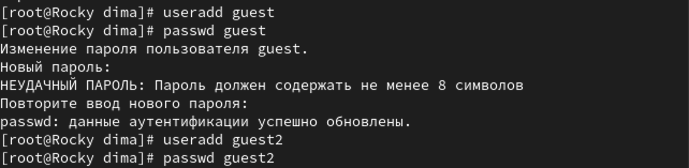{#fig:001 width=70%}

2. Добавили пользователя guest2 в guest (рис. @fig:002)

```bash
gpaswwd -a guest2 guest
```

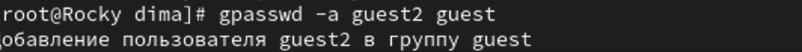{#fig:002 width=70%}

3. Осуществили вход в систему от двух разных пользователей (рис. @fig:003):

```bash
su - guest
su - guest2
```

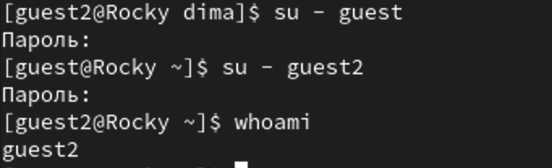{#fig:003 width=70%}

4. Определили директорию, в которой находится каждый из пользователей, командой ```pwd``` (рис. @fig:004, @fig:005).

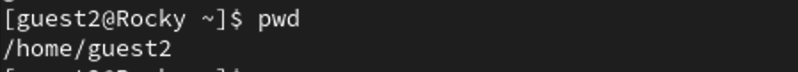{#fig:004 width=70%}

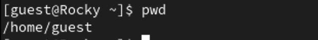{#fig:005 width=70%}

5. Сравнили выводы команд ```groups```, ```id -G``` и ```id -Gn``` для обоих пользователей. Заметили, что команды ```groups```, ```id -Gn```
выводят названия групп, а команда ```id -G``` их uid.

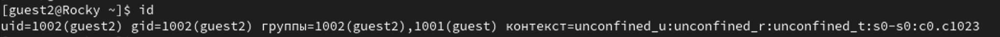{#fig:006 width=70%}

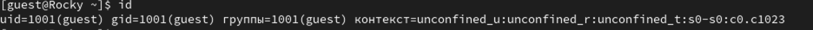{#fig:007 width=70%}

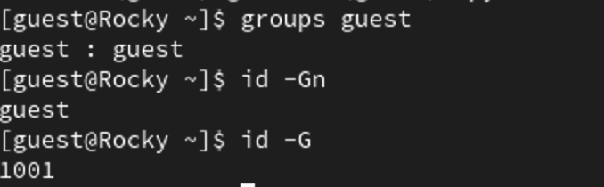{#fig:008 width=70%}

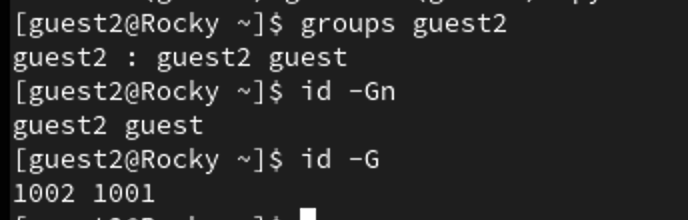{#fig:009 width=70%}

6. Просмотрели файл /etc/group командой ```cat /etc/group | grep guest```

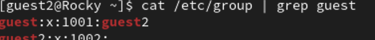{#fig:010 width=70%}

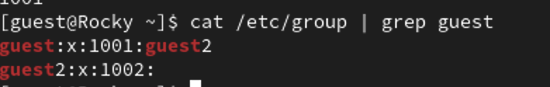{#fig:011 width=70%}

7. От имени пользователя guest2 зарегистрировали пользователя в группе guest командой ```newgrp guest``` (рис. @fig:012)

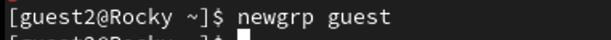{#fig:012 width=70%}

8. От имени пользователя guest изменили права директории /home/guest, разрешив все действия для пользователей группы

```bash
chmod g+rwx /home/guest
```

9. От имени пользователя guest сняли все атрибуты с директории /home/guest/dir1

```bash
chmod 00 dir1
```

10. Заполнили таблицу возможных действий с различными атрибутами директории (рис. @fig:013)

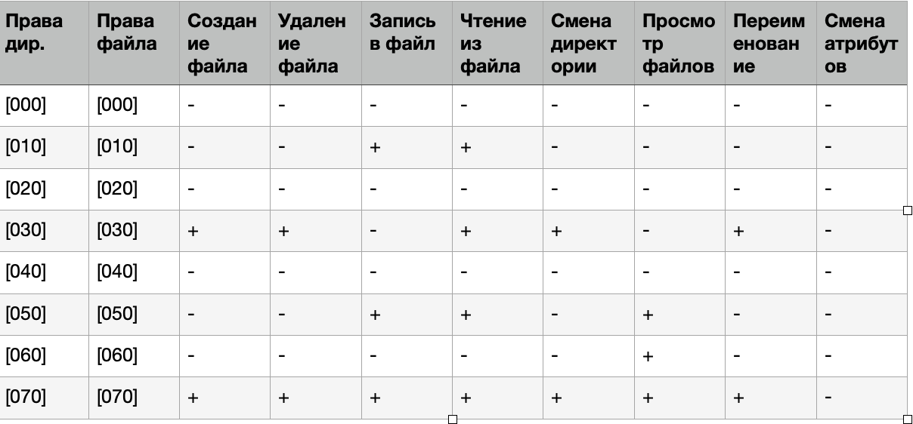{#fig:013 width=70%}

11. Заполнили таблицу минимально неободимых атрибутов для определенных действий (рис. @fig:014)

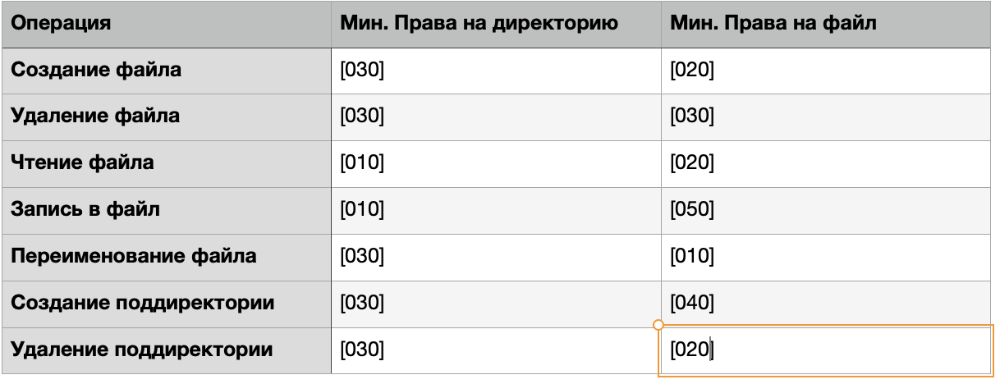{#fig:014 width=70%}


# Выводы

Получили практические навыки работы с атрибутами директорий и файлов в группе в консоли.

# Список литературы{.unnumbered}

::: {#refs}
:::
