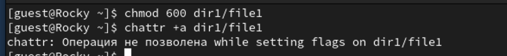
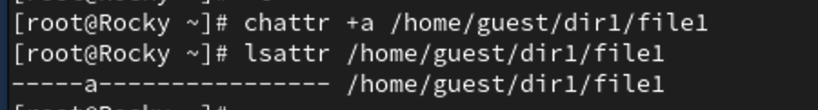
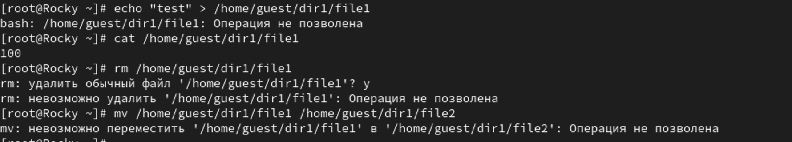
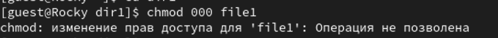
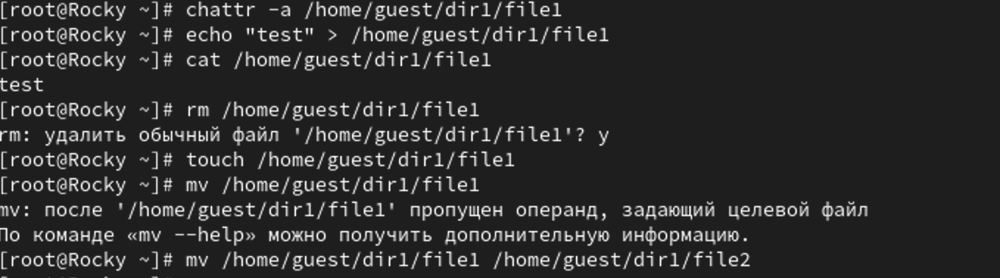
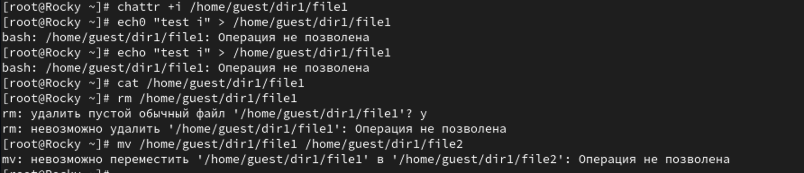

---
## Front matter
lang: ru-RU
title: Лабораторная работа №4
subtitle: Дискреционное разграничение прав в Linux. Расширенные атрибуты
author:
  - Шестаков Д. С.
institute:
  - Российский университет дружбы народов, Москва, Россия
date: 30 сентября 2023

## i18n babel
babel-lang: russian
babel-otherlangs: english

## Formatting pdf
toc: false
toc-title: Содержание
slide_level: 2
aspectratio: 169
section-titles: true
theme: metropolis
header-includes:
 - \metroset{progressbar=frametitle,sectionpage=progressbar,numbering=fraction}
 - '\makeatletter'
 - '\beamer@ignorenonframefalse'
 - '\makeatother'
---

# Информация

## Докладчик

:::::::::::::: {.columns align=center}
::: {.column width="70%"}

  * Шестаков Дмитрий Сергеевич
  * студент группы НКНбд-01-20
  * Российский университет дружбы народов
  * [dmshestakov@icloud.com](mailto:dmshestakov@icloud.com)

:::
::::::::::::::

# Вводная часть

## Объект и предмет исследования

- Дискрецинное разграничение прав
- ОС Linux
- Bash

## Цели и задачи

Получение практических навыков работы в консоли с расширенными атрибутами файлов.

## Материалы и методы

- ОС Linux
- Bash

## Ход работы

От имени пользователя guest определили расширенные атибуты файла командой

```bash
lsattr /home/guest/dir1/file1
```
:::::::::::::: {.columns align=center}
::: {.column width="70%"}
{#fig:001 width=70%}
:::
::::::::::::::


## Ход работы

Установили на файл прав, разрешающие чтени и запись, командой

```bash
chmod 600 dir1/file1
```

Попробовали установить расширенные атрибуты на файл командой

```bash
chattr +a dir1/file1
```
и получили отказ.

## Ход работы

:::::::::::::: {.columns align=center}
::: {.column width="70%"}
{#fig:001 width=70%}
:::
::::::::::::::

## Ход работы

Зашли на еще одну консоль под пользователем root и запустили ту же команду.

Проверили установку атрибутов

## Ход работы

:::::::::::::: {.columns align=center}
::: {.column width="70%"}
{#fig:003 width=70%}
:::
::::::::::::::

## Ход работы

Попробовали дописать в файл

```bash
echo "test" > /home/guest/dir1/file1
```

Прочитали из файла 

```bash
cat /home/guest/dir1/file1
```

Попорбовали стереть и переименовать файл. Получили отказ в доступе

## Ход работы

:::::::::::::: {.columns align=center}
::: {.column width="70%"}
{#fig:004 width=70%}
:::
::::::::::::::

## Ход работы

Попробовали изменить атрибуты командой

```bash
chmod 000 /home/guest/dir1/file1
```

## Ход работы

:::::::::::::: {.columns align=center}
::: {.column width="70%"}
{#fig:005 width=70%}
:::
::::::::::::::

## Ход работы

Сняли атрибут a и проделали все те же шаги 

:::::::::::::: {.columns align=center}
::: {.column width="70%"}
{#fig:006 width=70%}
:::
::::::::::::::

## Ход работы

Поставили атрибут и проделали те же шаги

:::::::::::::: {.columns align=center}
::: {.column width="70%"}
{#fig:007 width=70%}
:::
::::::::::::::

## Вывод

В результате выполнения работы мы повысили свои навыки использования интерфейса командой строки (CLI), познакомились на примерах с тем, как используются основные и расширенные атрибуты при разграничении доступа. Имели возможность связать теорию дискреционного разделения доступа (дискреционная политика безопасности) с её реализацией на практике в ОС Linux. С Опробовали действие на практике расширенных атрибутов «а» и «i».