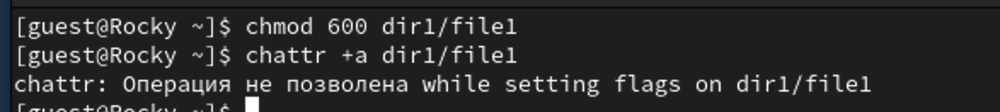
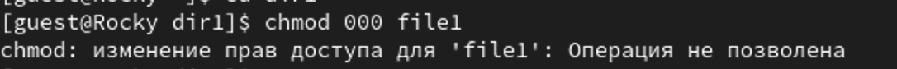
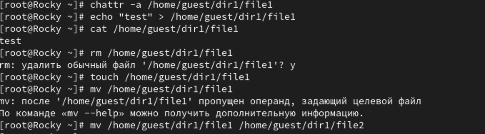
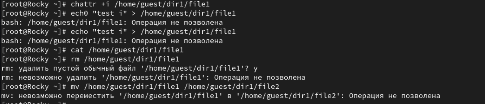

---
## Front matter
title: "Лабораторная работа №4"
subtitle: "Дискреционное разграничение прав в Linux. Расширенные атрибуты"
author: "Дмитрий Сергеевич Шестаков"

## Generic otions
lang: ru-RU
toc-title: "Содержание"

## Bibliography
bibliography: bib/cite.bib
csl: pandoc/csl/gost-r-7-0-5-2008-numeric.csl

## Pdf output format
toc: true # Table of contents
toc-depth: 2
lof: true # List of figures
lot: true # List of tables
fontsize: 12pt
linestretch: 1.5
papersize: a4
documentclass: scrreprt
## I18n polyglossia
polyglossia-lang:
  name: russian
  options:
	- spelling=modern
	- babelshorthands=true
polyglossia-otherlangs:
  name: english
## I18n babel
babel-lang: russian
babel-otherlangs: english
## Fonts
mainfont: PT Serif
romanfont: PT Serif
sansfont: PT Sans
monofont: PT Mono
mainfontoptions: Ligatures=TeX
romanfontoptions: Ligatures=TeX
sansfontoptions: Ligatures=TeX,Scale=MatchLowercase
monofontoptions: Scale=MatchLowercase,Scale=0.9
## Biblatex
biblatex: true
biblio-style: "gost-numeric"
biblatexoptions:
  - parentracker=true
  - backend=biber
  - hyperref=auto
  - language=auto
  - autolang=other*
  - citestyle=gost-numeric
## Pandoc-crossref LaTeX customization
figureTitle: "Рис."
tableTitle: "Таблица"
listingTitle: "Листинг"
lofTitle: "Список иллюстраций"
lotTitle: "Список таблиц"
lolTitle: "Листинги"
## Misc options
indent: true
header-includes:
  - \usepackage{indentfirst}
  - \usepackage{float} # keep figures where there are in the text
  - \floatplacement{figure}{H} # keep figures where there are in the text
---

# Цель работы

Получение практических навыков работы в консоли с расширенными атрибутами файлов.

# Выполнение лабораторной работы

1. От имени пользователя guest определили расширенные атибуты файла командой (рис. @fig:001)

```bash
lsattr /home/guest/dir1/file1
```

{#fig:001 width=70%}

2. Установили на файл прав, разрешающие чтени и запись, командой (рис. @fig:002)

```bash
chmod 600 dir1/file1
```

3. Попробовали установить расширенные атрибуты на файл командой (рис. @fig:002)

```bash
chattr +a dir1/file1
```
и получили отказ.

{#fig:002 width=70%}

4. Зашли на еще одну консоль под пользователем root и запустили ту же команду.(рис. @fig:003)

5. Проверили установку атрибутов (рис. @fig:003)

{#fig:003 width=70%}

6. Попробовали дописать в файл (рис. @fig:004)

```bash
echo "test" > /home/guest/dir1/file1
```

7. Прочитали из файла (рис. @fig:004)

```bash
cat /home/guest/dir1/file1
```

8. Попорбовали стереть и переименовать файл. Получили отказ в доступе (рис. @fig:004)

{#fig:004 width=70%}

9. Попробовали изменить атрибуты командой (рис. @fig:005)

```bash
chmod 000 /home/guest/dir1/file1
```

{#fig:005 width=70%}

10. Сняли атрибут a и проделали все те же шаги (рис. @fig:006)

{#fig:006 width=70%}

11. Поставили атрибут и проделали те же шаги (рис. @fig:007)

{#fig:007 width=70%}

# Выводы

В результате выполнения работы мы повысили свои навыки использования интерфейса командой строки (CLI), познакомились на примерах с тем, как используются основные и расширенные атрибуты при разграничении доступа. Имели возможность связать теорию дискреционного разделения доступа (дискреционная политика безопасности) с её реализацией на практике в ОС Linux. С Опробовали действие на практике расширенных атрибутов «а» и «i».

