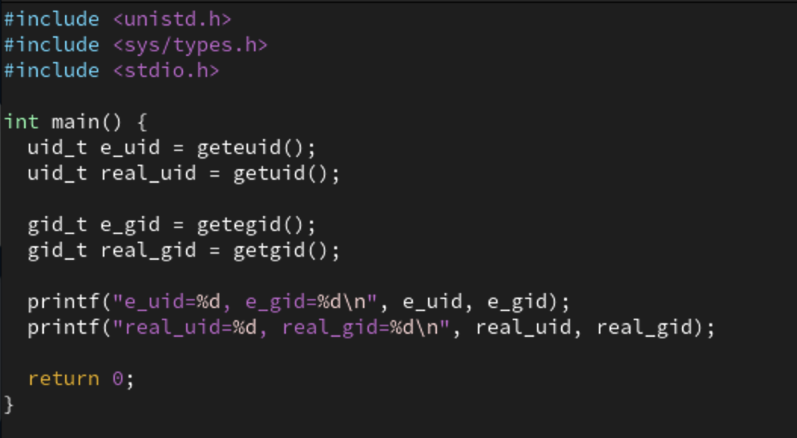
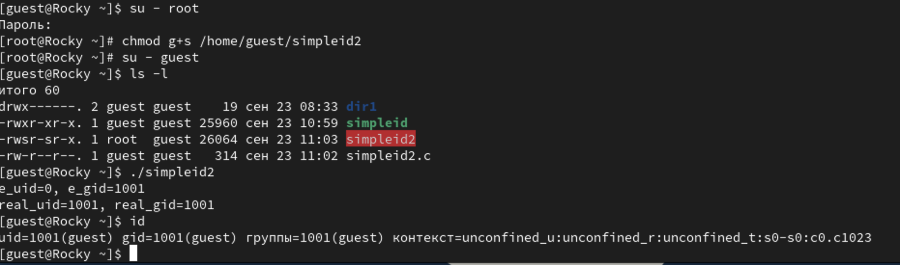
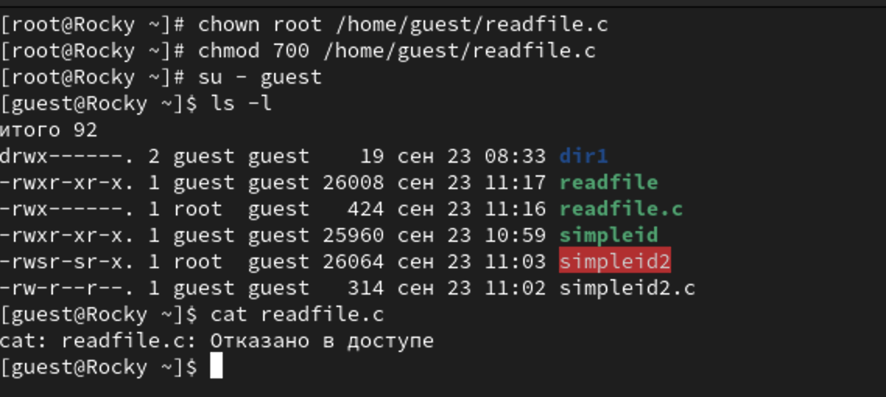
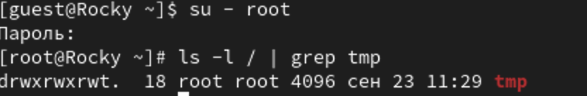
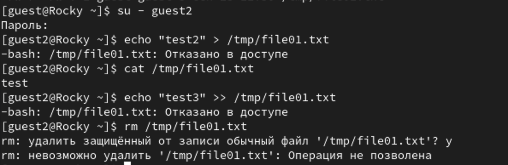

---
## Front matter
lang: ru-RU
title: Лабораторная работа №5
subtitle: Дискреционное разграничение прав в Linux. Исследование влияния дополнительных атрибутов
author:
  - Шестаков Д. С.
institute:
  - Российский университет дружбы народов, Москва, Россия
date: 30 сентября 2023

## i18n babel
babel-lang: russian
babel-otherlangs: english

## Formatting pdf
toc: false
toc-title: Содержание
slide_level: 2
aspectratio: 169
section-titles: true
theme: metropolis
header-includes:
 - \metroset{progressbar=frametitle,sectionpage=progressbar,numbering=fraction}
 - '\makeatletter'
 - '\beamer@ignorenonframefalse'
 - '\makeatother'
---

# Информация

## Докладчик

:::::::::::::: {.columns align=center}
::: {.column width="70%"}

  * Шестаков Дмитрий Сергеевич
  * студент группы НКНбд-01-20
  * Российский университет дружбы народов
  * [dmshestakov@icloud.com](mailto:dmshestakov@icloud.com)

:::
::::::::::::::

# Вводная часть

## Объект и предмет исследования

- Дискрецинное разграничение прав
- ОС Linux
- Bash

## Цели и задачи

Изучение механизмов изменения идентификаторов, применения SetUID- и Sticky-битов. Получение практических навыков работы в консоли с дополнительными атрибутами. Рассмотрение работы механизма смены идентификатора процессов пользователей, а также влияние бита Sticky на запись и удаление файлов

## Материалы и методы

- ОС Linux
- Bash

## Ход работы

Зашли под именем пользователя guest. Создали программу simpleid.c.

:::::::::::::: {.columns align=center}
::: {.column width="70%"}
{#fig:001 width=70%}
:::
::::::::::::::


## Ход работы

Скомпилировали и запустили ее. Сравнили ее результат с выводом команды id

:::::::::::::: {.columns align=center}
::: {.column width="70%"}
{#fig:002 width=70%}
:::
::::::::::::::

## Ход работы

Усложнили программу simpleid.c и получили программу simpleid2.c

:::::::::::::: {.columns align=center}
::: {.column width="70%"}
{#fig:003 width=70%}
:::
::::::::::::::

## Ход работы

Скомпилировали и запустили программу simpleid2.c

:::::::::::::: {.columns align=center}
::: {.column width="70%"}
{#fig:004 width=70%}
:::
::::::::::::::

## Ход работы

От имени суперпользователя выполнили команды: 

```bash
chown root:guest /home/guest/simpleid2
chmod u+s /home/guest/simpleid2
```
Выполнили проверка правильности установки новых атрибутов и запсутили программу simpleid2.c и id

:::::::::::::: {.columns align=center}
::: {.column width="70%"}
{#fig:005 width=70%}
:::
::::::::::::::

## Ход работы

Проделали то же самое относительно SetGID-бита

:::::::::::::: {.columns align=center}
::: {.column width="70%"}
{#fig:006 width=70%}
:::
::::::::::::::

## Ход работы

Создали программу readfile.c

:::::::::::::: {.columns align=center}
::: {.column width="70%"}
{#fig:007 width=70%}
:::
::::::::::::::

## Ход работы

Изменили владельца файла readfile.c и настроили так, чтобы только суперпользователь мог его прочитать. И проверили, что пользователь guest не может его прочитать.

:::::::::::::: {.columns align=center}
::: {.column width="70%"}
{#fig:008 width=70%}
:::
::::::::::::::

## Ход работы

Сменили у программы readfile пользователя и установили SetUD-бит. И проверили, что программа может прочитать файл readfile.c и 
/etc/shadow.

:::::::::::::: {.columns align=center}
::: {.column width="70%"}
{#fig:009 width=70%}
:::
::::::::::::::

## Ход работы

Выяснили установлен ли Sticky-бит на директории /tmp командой:
```bash
ls -l / | grep /tmp
```

:::::::::::::: {.columns align=center}
::: {.column width="70%"}
{#fig:010 width=70%}
:::
::::::::::::::

## Ход работы

Создали file01.txt, записали туда слово "test", проверили атрибуты файла и разрешили чтение и запись для категории "все остальные".

:::::::::::::: {.columns align=center}
::: {.column width="70%"}
{#fig:011 width=70%}
:::
::::::::::::::

## Ход работы

Попытались прочитать файл, дописать, переписать и удалить файл от имени пользователя guest2. Получилось только прочитать file01.txt

:::::::::::::: {.columns align=center}
::: {.column width="70%"}
{#fig:012 width=70%}
:::
::::::::::::::

## Ход работы

Перешли в режим суперпользователя и сняли Sticky-бит.

:::::::::::::: {.columns align=center}
::: {.column width="70%"}
{#fig:013 width=70%}
:::
::::::::::::::

## Ход работы

Проделали все те же шаги из пункта 12. В этот раз также удалось удалить файл.

:::::::::::::: {.columns align=center}
::: {.column width="70%"}
{#fig:014 width=70%}
:::
::::::::::::::


## Вывод

Изучили механизмы изменения идентификаторов, применения SetUID- и Sticky-битов. Получили практические навыки работы в консоли с дополнительными атрибутами. Рассмотрели работу механизма смены идентификатора процессов пользователей, а также влияние бита Sticky на запись и удаление файлов.