---
## Front matter
title: "Отчет по лабораторной работе №5"
subtitle: "Дискреционное разграничение прав в Linux. Исследование влияния дополнительных атрибутов"
author: "Дмитрий Сергеевич Шестаков"

## Generic otions
lang: ru-RU
toc-title: "Содержание"

## Bibliography
bibliography: bib/cite.bib
csl: pandoc/csl/gost-r-7-0-5-2008-numeric.csl

## Pdf output format
toc: true # Table of contents
toc-depth: 2
lof: true # List of figures
lot: true # List of tables
fontsize: 12pt
linestretch: 1.5
papersize: a4
documentclass: scrreprt
## I18n polyglossia
polyglossia-lang:
  name: russian
  options:
	- spelling=modern
	- babelshorthands=true
polyglossia-otherlangs:
  name: english
## I18n babel
babel-lang: russian
babel-otherlangs: english
## Fonts
mainfont: PT Serif
romanfont: PT Serif
sansfont: PT Sans
monofont: PT Mono
mainfontoptions: Ligatures=TeX
romanfontoptions: Ligatures=TeX
sansfontoptions: Ligatures=TeX,Scale=MatchLowercase
monofontoptions: Scale=MatchLowercase,Scale=0.9
## Biblatex
biblatex: true
biblio-style: "gost-numeric"
biblatexoptions:
  - parentracker=true
  - backend=biber
  - hyperref=auto
  - language=auto
  - autolang=other*
  - citestyle=gost-numeric
## Pandoc-crossref LaTeX customization
figureTitle: "Рис."
tableTitle: "Таблица"
listingTitle: "Листинг"
lofTitle: "Список иллюстраций"
lotTitle: "Список таблиц"
lolTitle: "Листинги"
## Misc options
indent: true
header-includes:
  - \usepackage{indentfirst}
  - \usepackage{float} # keep figures where there are in the text
  - \floatplacement{figure}{H} # keep figures where there are in the text
---

# Цель работы

Изучение механизмов изменения идентификаторов, применения SetUID- и Sticky-битов. Получение практических навыков работы в консоли с дополнительными атрибутами. Рассмотрение работы механизма смены идентификатора процессов пользователей, а также влияние бита Sticky на запись и удаление файлов @Theory.

# Выполнение работы

1. Зашли под именем пользователя guest. Создали программу simpleid.c. (рис. @fig:001)

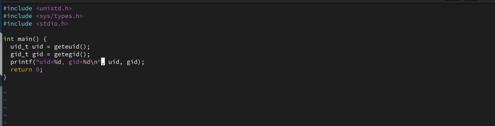{#fig:001 width=70%}

2. Скомпилировали и запустили ее. Сравнили ее результат с выводом команды id. (рис. @fig:002)

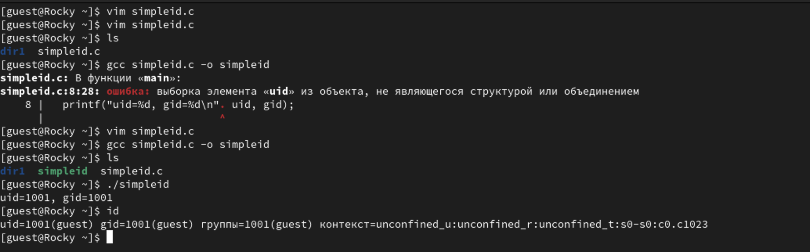{#fig:002 width=70%}

3. Усложнили программу simpleid.c и получили программу simpleid2.c. (рис. @fig:003)

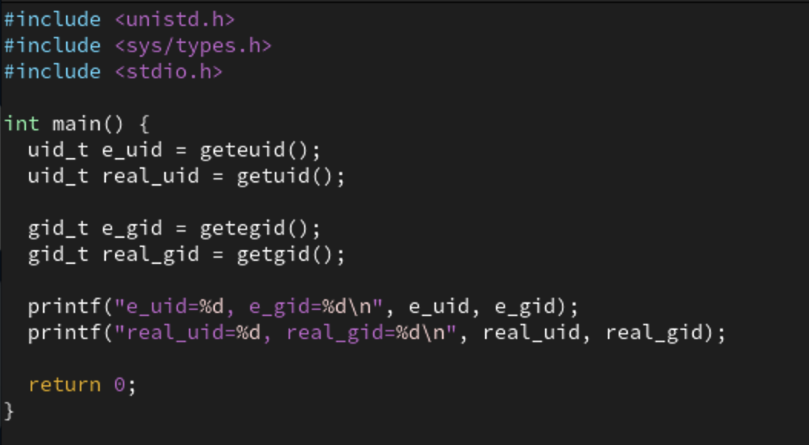{#fig:003 width=70%}

4. Скомпилировали и запустили программу simpleid2.c (рис. @fig:004)

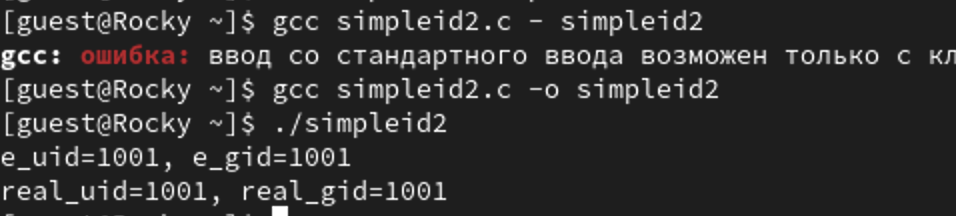{#fig:004 width=70%}

5. От имени суперпользователя выполнили команды: 

```bash
chown root:guest /home/guest/simpleid2
chmod u+s /home/guest/simpleid2
```
Выполнили проверка правильности установки новых атрибутов и запсутили программу simpleid2.c и id (рис. @fig:005)

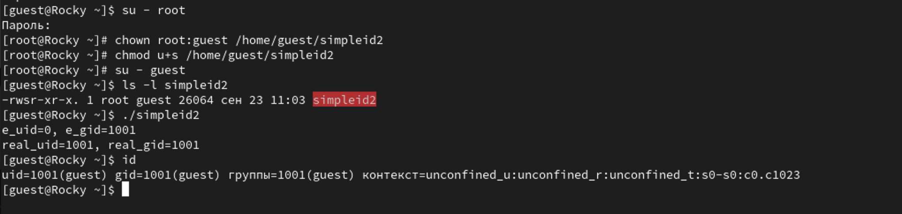{#fig:005 width=70%}

6. Проделали то же самое относительно SetGID-бита (рис. @fig:006)

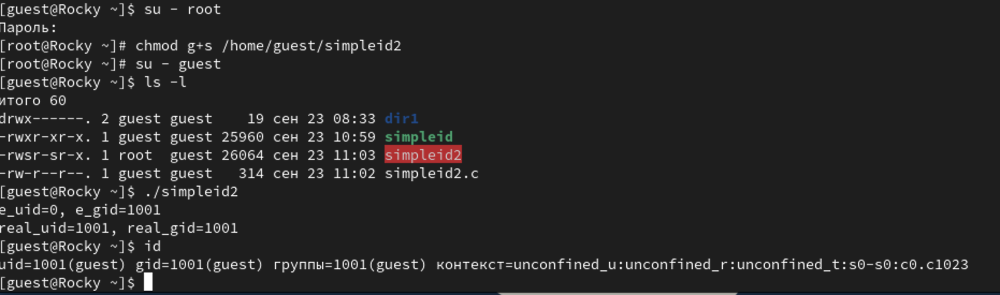{#fig:006 width=70%}

7. Создали программу readfile.c (рис. @fig:007)

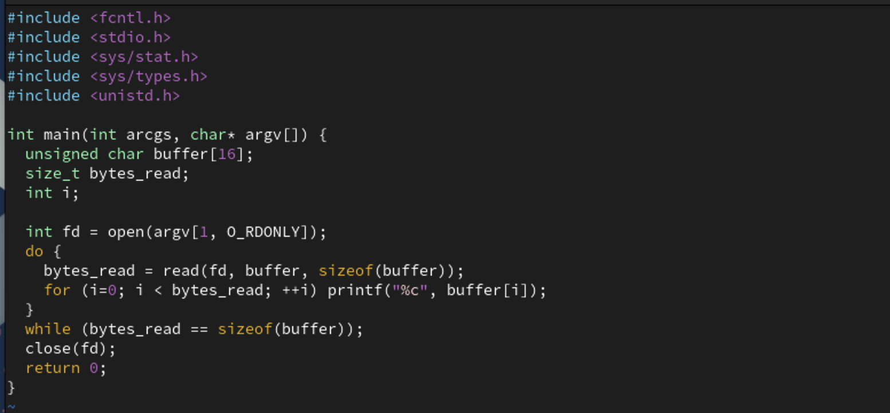{#fig:007 width=70%}

8. Изменили владельца файла readfile.c и настроили так, чтобы только суперпользователь мог его прочитать. И проверили, что пользователь guest не может его прочитать. (рис. @fig:008)

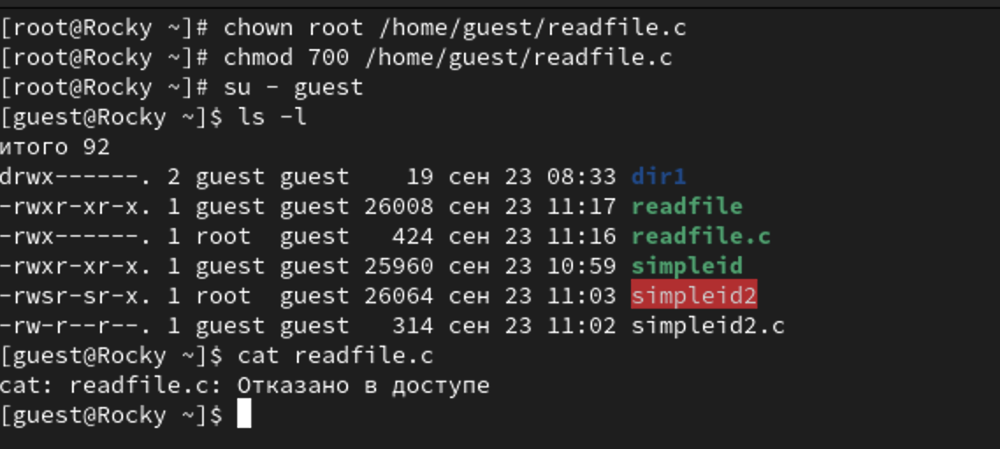{#fig:008 width=70%}

9. Сменили у программы readfile пользователя и установили SetUD-бит. И проверили, что программа может прочитать файл readfile.c и 
/etc/shadow. (рис. @fig:009)

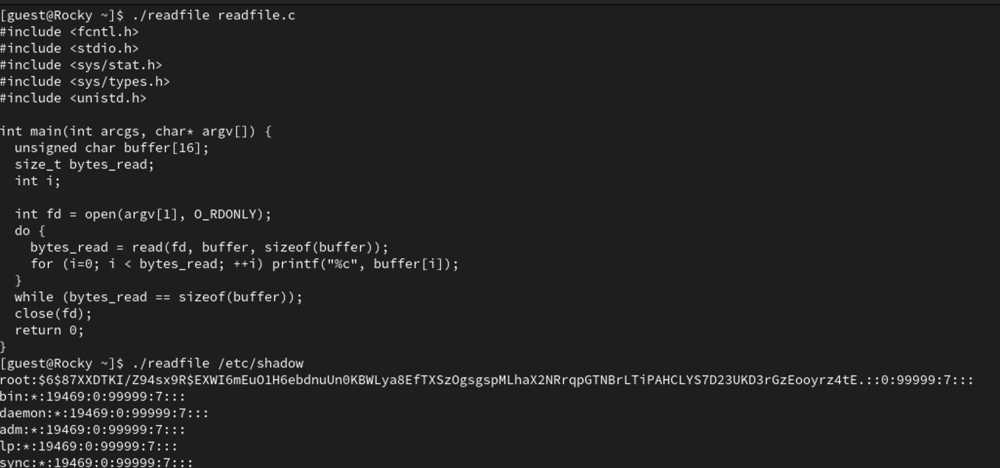{#fig:009 width=70%}

10. Выяснили установлен ли Sticky-бит на директории /tmp командой (рис. @fig:010):
```bash
ls -l / | grep /tmp
```

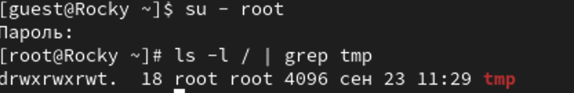{#fig:010 width=70%}

11. Создали file01.txt, записали туда слово "test", проверили атрибуты файла и разрешили чтение и запись для категории "все остальные". (рис. @fig:011)

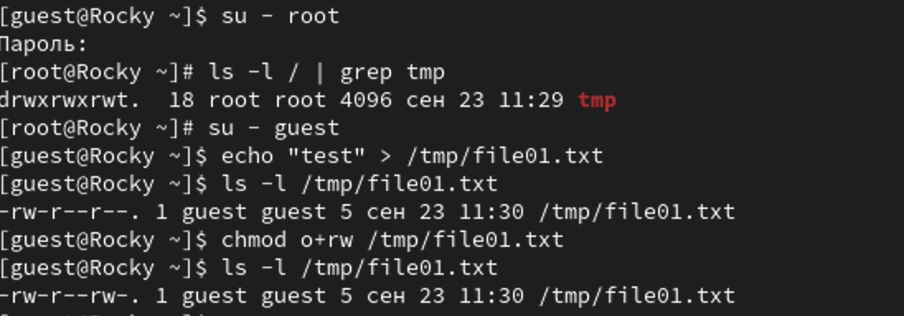{#fig:011 width=70%}

12. Попытались прочитать файл, дописать, переписать и удалить файл от имени пользователя guest2. Получилось только прочитать file01.txt (рис. @fig:012)

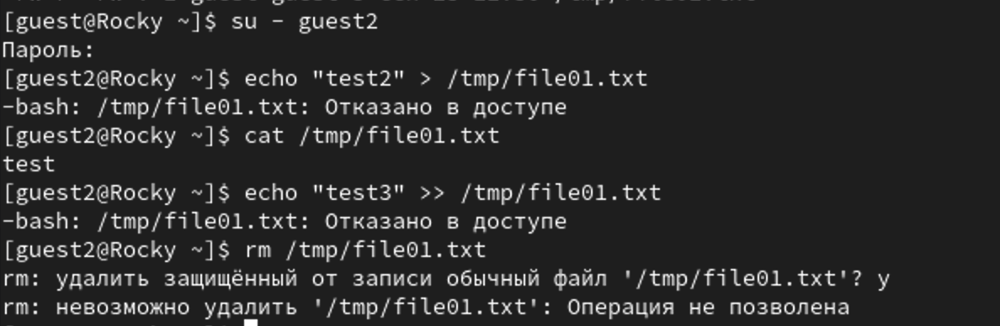{#fig:012 width=70%}

13. Перешли в режим суперпользователя и сняли Sticky-бит. (рис. @fig:013)

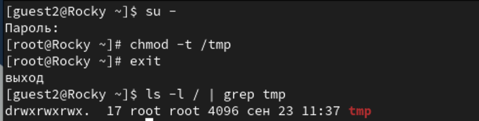{#fig:013 width=70%}

14. Проделали все те же шаги из пункта 12. В этот раз также удалось удалить файл. (рис. @fig:014)

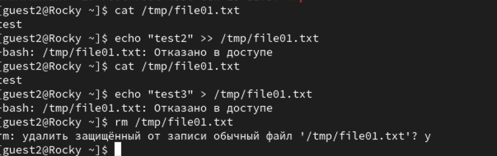{#fig:014 width=70%}


# Выводы

Изучили механизмы изменения идентификаторов, применения SetUID- и Sticky-битов. Получили практические навыки работы в консоли с дополнительными атрибутами. Рассмотрели работу механизма смены идентификатора процессов пользователей, а также влияние бита Sticky на запись и удаление файлов.

# Список литературы{.unnumbered}

::: {#refs}
:::
