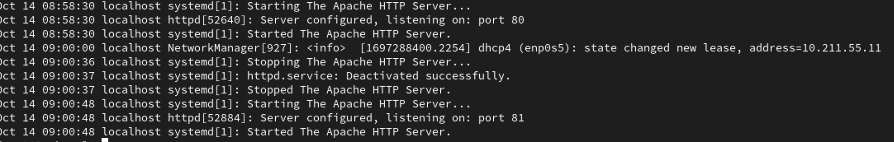

---
## Front matter
lang: ru-RU
title: Лабораторная работа №6
subtitle: Мандантное разграничение прав в Linux
author:
  - Шестаков Д. С.
institute:
  - Российский университет дружбы народов, Москва, Россия
date: 14 октября 2023

## i18n babel
babel-lang: russian
babel-otherlangs: english

## Formatting pdf
toc: false
toc-title: Содержание
slide_level: 2
aspectratio: 169
section-titles: true
theme: metropolis
header-includes:
 - \metroset{progressbar=frametitle,sectionpage=progressbar,numbering=fraction}
 - '\makeatletter'
 - '\beamer@ignorenonframefalse'
 - '\makeatother'
---

# Информация

## Докладчик

:::::::::::::: {.columns align=center}
::: {.column width="70%"}

  * Шестаков Дмитрий Сергеевич
  * студент группы НКНбд-01-20
  * Российский университет дружбы народов
  * [dmshestakov@icloud.com](mailto:dmshestakov@icloud.com)

:::
::::::::::::::

# Вводная часть

## Объект и предмет исследования

- Мандатное разграничение прав
- ОС Linux
- Bash

## Цели и задачи

Развить навыки администрирования ОС Linux. Получить первое практическое знакомство с технологией SELinux1.
Проверить работу SELinx на практике совместно с веб-сервером Apache.

## Материалы и методы

- ОС Linux
- Bash

## Ход работы

1. Вошли в систему и убедились, что SELinux работает в режиме enforcing политики targeted с помощью команд getenforce и sestatus.

2. С помощью команды ```service httpd status``` убедились, что веб-сервер работает

:::::::::::::: {.columns align=center}
::: {.column width="70%"}
{#fig:001 width=70%}
:::
::::::::::::::


## Ход работы

Нашли веб-сервер Apache в списке процессов и определили ее контекст: unconfined_t

:::::::::::::: {.columns align=center}
::: {.column width="70%"}
{#fig:002 width=70%}
:::
::::::::::::::

## Ход работы

Посмотрели текущее состояние преключателей SELinux для Apache с помощью команды ```sestatus -b | grep httpd```

:::::::::::::: {.columns align=center}
::: {.column width="70%"}
{#fig:003 width=70%}
:::
::::::::::::::

## Ход работы

Посмотрели статистику по политике, также определили множество пользователей, ролей, типов

:::::::::::::: {.columns align=center}
::: {.column width="70%"}
{#fig:004 width=70%}
:::
::::::::::::::

## Ход работы

Определили тип файлов и поддиректорий, находящихся в директории ```/var/www```

:::::::::::::: {.columns align=center}
::: {.column width="70%"}
{#fig:005 width=70%}
:::
::::::::::::::

## Ход работы

Определили тип файлов в директории ```/var/www/html```

:::::::::::::: {.columns align=center}
::: {.column width="70%"}
{#fig:006 width=70%}
:::
::::::::::::::

## Ход работы

Создайте от имени суперпользователя html-файл ```var/www/html/test.html``` следующего содержания:

```html
<html>
<body>test</body>
</html>
```

## Ход работы

 - Проверили контекст созданного файла

 - Обратились к файлу через веб-сервер, введя в браузере адрес ```http://127.0.01/test.html```.

:::::::::::::: {.columns align=center}
::: {.column width="70%"}
{#fig:007 width=70%}
:::
::::::::::::::

## Ход работы

 - Изучили справку ```man httpd_selinux```. Узнали, что существуют следующие контексты файлов: unconfined_u, object_r, system_r, secadm_r, httpd_sys_content_r.

 - Изменили контекст файла ```/var/www/html/test.html``` на samba_share_t.

:::::::::::::: {.columns align=center}
::: {.column width="70%"}
{#fig:008 width=70%}
:::
::::::::::::::

## Ход работы

 - Попробовали еще раз получить доступ к файлу через веб-сервер. Не получили сообщнеие об ошибке.

 - Посмотрели системный лог-файл

:::::::::::::: {.columns align=center}
::: {.column width="70%"}
{#fig:009 width=70%}
:::
::::::::::::::

## Ход работы

 - Запустили веб-сервер Apache на прослушивание TCP-порта 81.

 - Выполнили перезапуск веб-сервера. Сбой не произошел.

:::::::::::::: {.columns align=center}
::: {.column width="70%"}
{#fig:010 width=70%}
:::
::::::::::::::

## Ход работы

Проанализировали лог-файлы, и выяснили, что запись появилась только в ```/var/log/messages```.

:::::::::::::: {.columns align=center}
::: {.column width="70%"}
{#fig:011 width=70%}
:::
::::::::::::::

## Ход работы

Выполнили команду ```bash semanage port -a -t http_port_t -p tcp 81```.

:::::::::::::: {.columns align=center}
::: {.column width="70%"}
{#fig:014 width=70%}
:::
::::::::::::::

## Ход работы

 - Перезапустили веб-сервер, также не сбой не произошел. Вернули контекст файлу ```/var/www/html/test.html```.

 - Исправили обратно конфигурационный файл Apache.


## Вывод

Изучили механизмы изменения идентификаторов, применения SetUID- и Sticky-битов. Получили практические навыки работы в консоли с дополнительными атрибутами. Рассмотрели работу механизма смены идентификатора процессов пользователей, а также влияние бита Sticky на запись и удаление файлов.