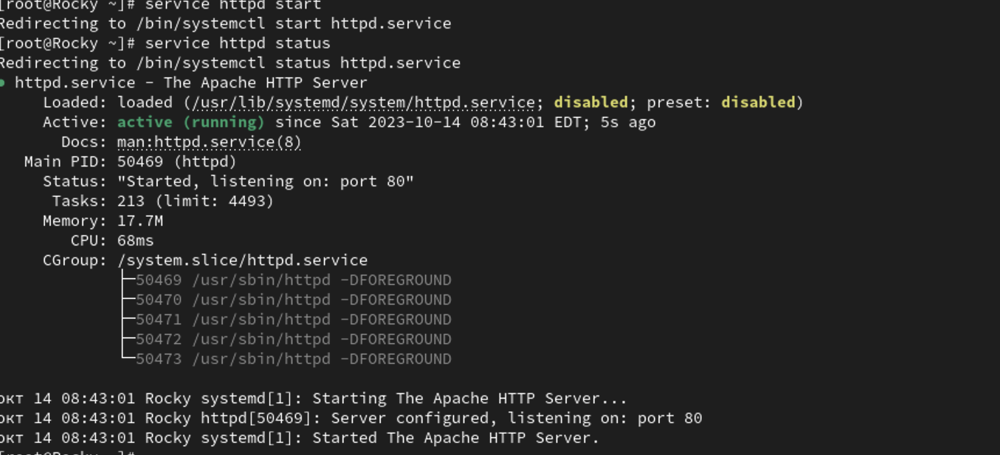
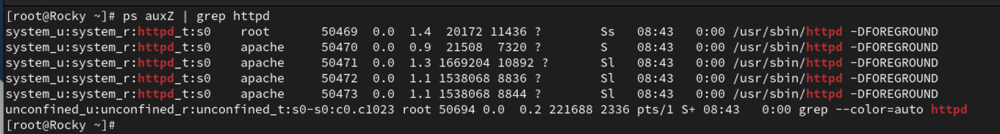
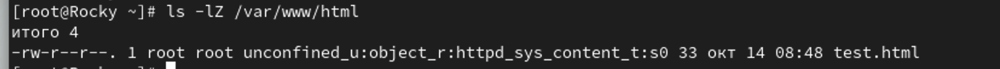
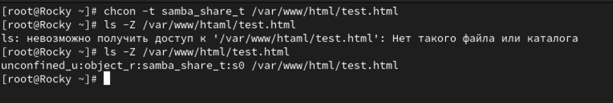
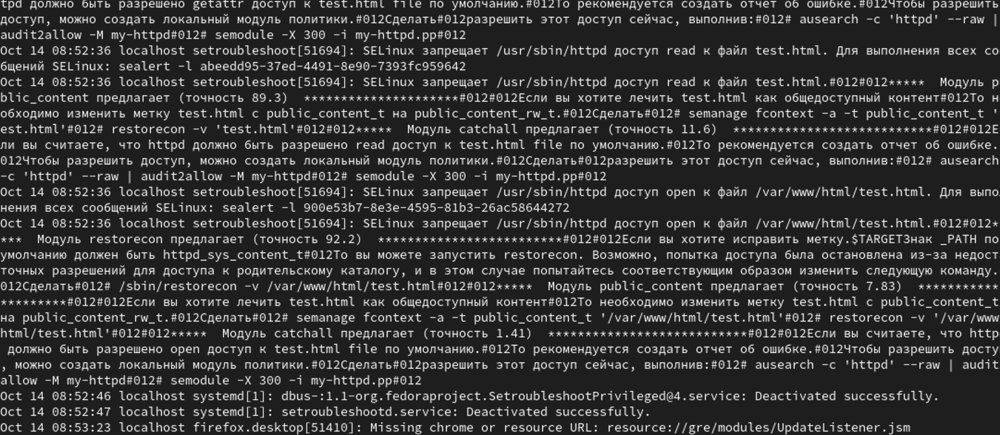

---
## Front matter
title: "Отчет по лабораторной работе №6"
subtitle: "Мандатное разграничение прав в Linux"
author: "Дмитрий Сергеевич Шестаков"

## Generic otions
lang: ru-RU
toc-title: "Содержание"

## Bibliography
bibliography: bib/cite.bib
csl: pandoc/csl/gost-r-7-0-5-2008-numeric.csl

## Pdf output format
toc: true # Table of contents
toc-depth: 2
lof: true # List of figures
lot: true # List of tables
fontsize: 12pt
linestretch: 1.5
papersize: a4
documentclass: scrreprt
## I18n polyglossia
polyglossia-lang:
  name: russian
  options:
	- spelling=modern
	- babelshorthands=true
polyglossia-otherlangs:
  name: english
## I18n babel
babel-lang: russian
babel-otherlangs: english
## Fonts
mainfont: PT Serif
romanfont: PT Serif
sansfont: PT Sans
monofont: PT Mono
mainfontoptions: Ligatures=TeX
romanfontoptions: Ligatures=TeX
sansfontoptions: Ligatures=TeX,Scale=MatchLowercase
monofontoptions: Scale=MatchLowercase,Scale=0.9
## Biblatex
biblatex: true
biblio-style: "gost-numeric"
biblatexoptions:
  - parentracker=true
  - backend=biber
  - hyperref=auto
  - language=auto
  - autolang=other*
  - citestyle=gost-numeric
## Pandoc-crossref LaTeX customization
figureTitle: "Рис."
tableTitle: "Таблица"
listingTitle: "Листинг"
lofTitle: "Список иллюстраций"
lotTitle: "Список таблиц"
lolTitle: "Листинги"
## Misc options
indent: true
header-includes:
  - \usepackage{indentfirst}
  - \usepackage{float} # keep figures where there are in the text
  - \floatplacement{figure}{H} # keep figures where there are in the text
---

# Цель работы

Развить навыки администрирования ОС Linux. Получить первое практическое знакомство с технологией SELinux1.
Проверить работу SELinx на практике совместно с веб-сервером Apache. @Theory

# Выполнение лабораторной работы

1. Вошли в систему и убедились, что SELinux работает в режиме enforcing политики targeted с помощью команд getenforce и sestatus.

2. С помощью команды ```service httpd status``` убедились, что веб-сервер работает (рис. @fig:001).

{#fig:001 width=70%}

3. Нашли веб-сервер Apache в списке процессов и определили ее контекст: unconfined_t (рис. @fig:002).

{#fig:002 width=70%}

4. Посмотрели текущее состояние преключателей SELinux для Apache с помощью команды ```sestatus -b | grep httpd```(рис. @fig:003)

{#fig:003 width=70%}

5. Посмотрели статистику по политике, также определили множество пользователей, ролей, типов.(рис. @fig:004)

{#fig:004 width=70%}

6. Определили тип файлов и поддиректорий, находящихся в директории ```/var/www``` (рис. @fig:005)

{#fig:005 width=70%}

7. Определили тип файлов в директории ```/var/www/html```. (рис. @fig:006)

{#fig:006 width=70%}

8. Создайте от имени суперпользователя html-файл ```var/www/html/test.html``` следующего модержания:

```html
<html>
<body>test</body>
</html>
```

9. Проверили контекст созданного файла (рис. @fig:008)

10. Обратились к файлу через веб-сервер, введя в браузере адрес ```http://127.0.01/test.html```. (рис. @fig:007)

{#fig:007 width=70%}

11. Изучили справку ```man httpd_selinux```. Узнали, что существуют следующие контексты файлов: unconfined_u, object_r, system_r, secadm_r, httpd_sys_content_r.

12. Изменили контекст файла ```/var/www/html/test.html``` на samba_share_t. (рис. @fig:008)

{#fig:008 width=70%}

13. Попробовали еще раз получить доступ к файлу через веб-сервер. Не получили сообщнеие об ошибке.

14. Посмотрели системный лог-файл(рис. @fig:009)

{#fig:009 width=70%}

15. Запустили веб-сервер Apache на прослушивание TCP-порта 81.(рис. @fig:010)

16. Выполнили перезапуск веб-сервера. Сбой не произошел.(рис. @fig:010)

{#fig:010 width=70%}

17. Проанализировали лог-файлы, и выяснили, что запись появилась только в ```/var/log/messages```. (рис. @fig:011)

{#fig:011 width=70%}

{#fig:012 width=70%}

18. Выполнили команду ```bash semanage port -a -t http_port_t -p tcp 81```. (рис. @fig:014)

{#fig:014 width=70%}

19. Перезапустили веб-сервер, также не сбой не произошел. Вернули контекст файлу ```/var/www/html/test.html```.

20. Исправили обратно конфигурационный файл Apache.


# Выводы

Развили навыки администрирования ОС Linux. Получили первое практическое знакомство с технологией SELinux1.
Проверили работу SELinx на практике совместно с веб-сервером Apache.


# Список литературы{.unnumbered}

::: {#refs}
:::
