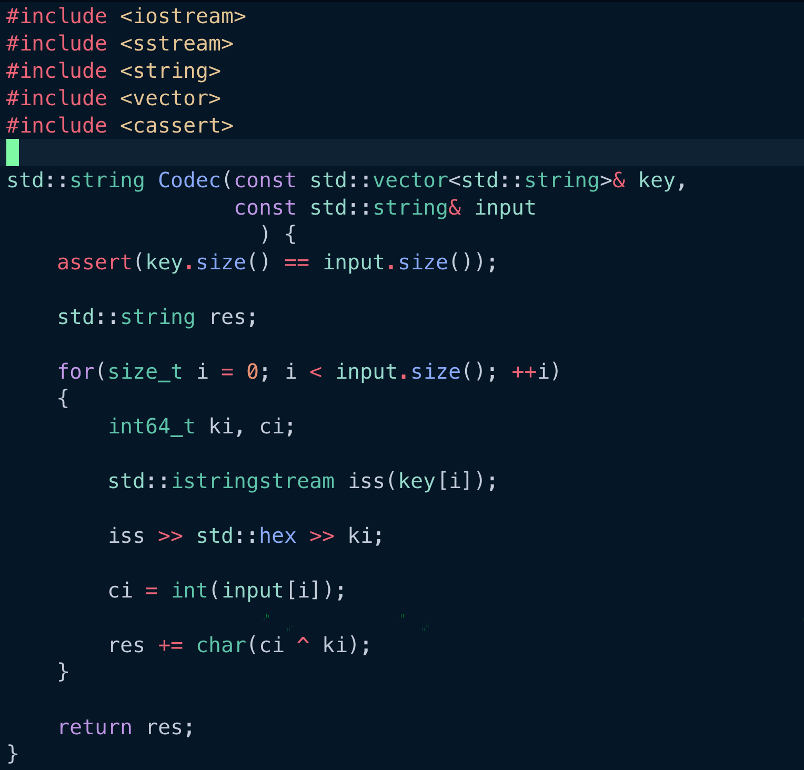
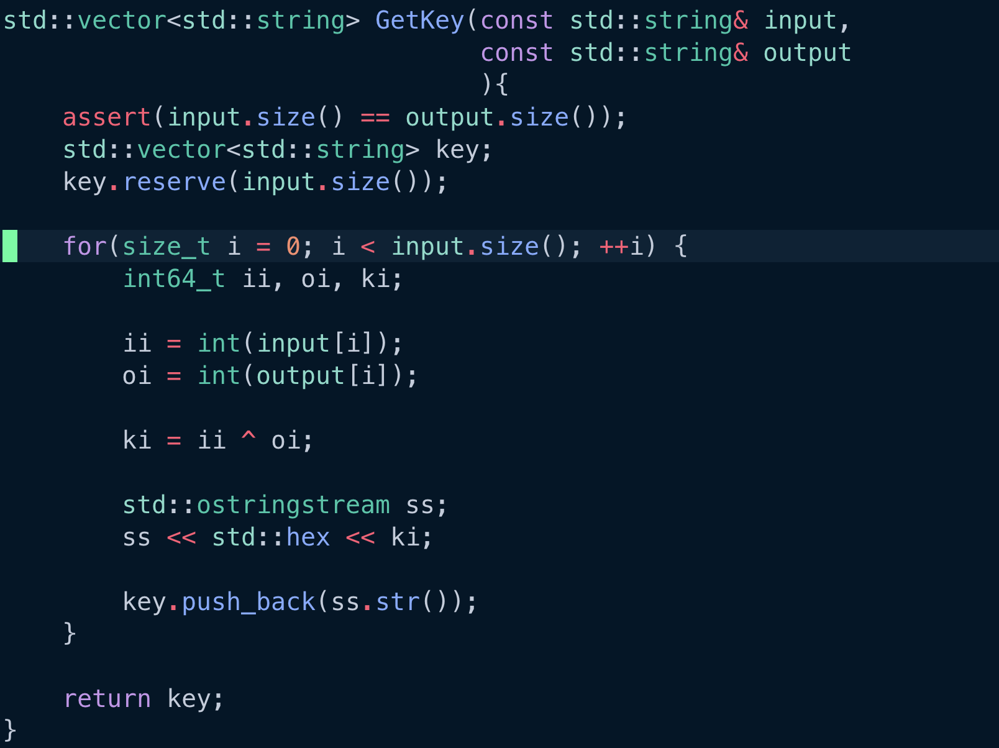

---
## Front matter
lang: ru-RU
title: Лабораторная работа №7
subtitle: Элементы криптографии. Однократное гаммирование
author:
  - Шестаков Д. С.
institute:
  - Российский университет дружбы народов, Москва, Россия

## i18n babel
babel-lang: russian
babel-otherlangs: english

## Formatting pdf
toc: false
toc-title: Содержание
slide_level: 2
aspectratio: 169
section-titles: true
theme: metropolis
header-includes:
 - \metroset{progressbar=frametitle,sectionpage=progressbar,numbering=fraction}
 - '\makeatletter'
 - '\beamer@ignorenonframefalse'
 - '\makeatother'
---

# Информация

## Докладчик

:::::::::::::: {.columns align=center}
::: {.column width="70%"}

  * Шестаков Дмитрий Сергеевич
  * студент группы НКНбд-01-20
  * Российский университет дружбы народов
  * [dmshestakov@icloud.com](mailto:dmshestakov@icloud.com)

:::
::::::::::::::

# Вводная часть

## Объект и предмет исследования

- Элементы криптографии
- Однократное гаммирование
- Язык программирования C++

## Цели и задачи

- Освоить на практике применение режима однократного гаммирования.

## Материалы и методы

- C++
- bash

# Ход работы

## Шифратор

:::::::::::::: {.columns align=center}
::: {.column width="70%"}
{#fig:001 width=70%}
:::
::::::::::::::

## Поиск ключа

:::::::::::::: {.columns align=center}
::: {.column width="70%"}
{#fig:003 width=70%}
:::
::::::::::::::

## Результаты

:::::::::::::: {.columns align=center}
::: {.column width="70%"}
{#fig:003 width=70%}
:::
::::::::::::::

## Вывод

Освоили на практике применение режима однократного гаммирования.

